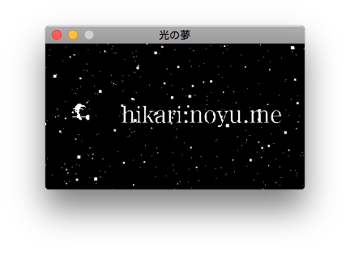

Everyone says I need a portable business card.

Well, I know POSIX: this is a portable C89 OpenGL “business card” using SDL2!

…why is everyone laughing?

----

Special thanks to ##OpenGL on Freenode.
